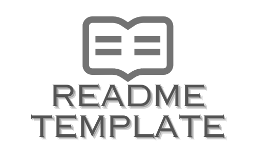

<!-- Improved compatibility of back to top link: See: https://github.com/othneildrew/Best-README-Template/pull/73 -->
<a id="readme-top"></a>
<!--
*** Thanks for checking out the Best-README-Template. If you have a suggestion
*** that would make this better, please fork the repo and create a pull request
*** or simply open an issue with the tag "enhancement".
*** Don't forget to give the project a star!
*** Thanks again! Now go create something AMAZING! :D
-->


<!-- PROJECT SHIELDS -->
<!--
*** I'm using markdown "reference style" links for readability.
*** Reference links are enclosed in brackets [ ] instead of parentheses ( ).
*** See the bottom of this document for the declaration of the reference variables
*** for contributors-url, forks-url, etc. This is an optional, concise syntax you may use.
*** https://www.markdownguide.org/basic-syntax/#reference-style-links
-->


<!-- PROJECT LOGO -->
<br />
<div align="center">
  <a href="reports/">
    
  </a>

  <h3 align="center">AI-powered Newsletter and Social Media Content Generator</h3>

  <p align="center">
    Read Project Report
    <br />
    <a href="reports/"><strong>Explore the docs »</strong></a>
    <br />
    <br />
    <a href="https://github.com/iaminhri/COSC-4P02/blob/master/reports/COSC_4P02_FINAL_REPORT.pdf">View Demo</a>
  </p>
</div>

<!-- TABLE OF CONTENTS -->
<details>
  <summary>Table of Contents</summary>
  <ol>
    <li>
      <a href="#about-the-project">About The Project</a>
      <ul>
        <li><a href="#built-with">Built With</a></li>
      </ul>
    </li>
    <li>
      <a href="#getting-started">Getting Started</a>
      <ul>
        <li><a href="#prerequisites">Prerequisites</a></li>
        <li><a href="#installation">Installation</a></li>
      </ul>
    </li>
    <li><a href="#usage">Usage</a></li>
    <li><a href="#roadmap">Roadmap</a></li>
    <li><a href="#contributing">Contributing</a></li>
    <li><a href="#license">License</a></li>
    <li><a href="#contact">Contact</a></li>
    <li><a href="#acknowledgments">Acknowledgments</a></li>
  </ol>
</details>


<!-- ABOUT THE PROJECT -->
## About The Project


## Project Summary  

### Our Goal  
Our goal is to develop a user-friendly website that will have a user profile and dashboard.  
It will also enable users to input a list of news and social media sources, topics, keywords, locations, or industries to generate personalized newsletters and social media content using advanced AI techniques such as Natural Language Processing (NLP).

The content will be formatted for various platforms, including:
- Email newsletters  
- Twitter posts  
- LinkedIn updates  
- Instagram captions  

This ensures both relevance and platform compatibility. Additionally, users will receive automated notifications at intervals they specify.

---

### Objectives  
- Save time by automating content aggregation, summarization, and delivery.
- Provide users with highly relevant and tailored content.
- Offer Software-as-a-Service (SaaS) to enable seamless interaction and personalized content delivery.
- Share generated content with other media platforms.

---

### Contribution of team members is located inside the /contributions/Contributions Sheet.pdf


Use the `BLANK_README.md` to get started.

<p align="right">(<a href="#readme-top">back to top</a>)</p>


### Built With

This section should list any major frameworks/libraries used to bootstrap your project. Leave any add-ons/plugins for the acknowledgements section. Here are a few examples.

* [![Django][Django.com]][Django-url]
* [![Python][Python.com]][Python-url]
* [![HTML][HTML.com]][HTML-url]
* [![CSS][CSS.com]][CSS-url]
* [![Bootstrap][Bootstrap.com]][Bootstrap-url]


<p align="right">(<a href="#readme-top">back to top</a>)</p>


<!-- GETTING STARTED -->
## Getting Started

This is an example of how you may give instructions on setting up your project locally.
To get a local copy up and running follow these simple example steps.

### Prerequisites

1. Use Git Clone to create a local repo
  ```sh
  git clone https://github.com/iaminhri/COSC-4P02.git
  ```
2. Change git remote url to avoid accidental pushes to base project. For more git operation refer to this [Documentation]([resources/GitHub Commands.pdf](https://github.com/iaminhri/COSC-4P02/blob/master/resources/GitHub%20Commands.pdf))
  ```sh
   git remote set-url origin github_username/repo_name
   git remote -v # confirm the changes
  ```

First Install Virtual Environment, makes life easier. 
3. Python Virtual Environment for MAC or Linux, For windows use VSCode virtual environment
  ```sh
  python3 -m venv venv
  source venv/bin/activate
  pip install --upgrade pip
  ```
4. Install The requirements file
  ```sh
  pip install -r requirements.txt
  ```

  
5. Some Django Application Useful Commands
* Shows all subcommands available
  ```sh
   django-admin
  ```
* Starts a new project
  ```sh
   django-admin startproject file_name
  ```
* To run the project
  ```sh
   python manage.py runserver 
  ```
* Change the port to access the localhost website
  ```sh
   python manage.py runserver 1313
  ```
* Creates an App functionality
  ```sh
   python manage.py startapp app_name 
  ```

<p align="right">(<a href="#readme-top">back to top</a>)</p>


<!-- USAGE EXAMPLES -->
## Usage

Use this space to show useful examples of how a project can be used. Additional screenshots, code examples and demos work well in this space. You may also link to more resources.

_For more examples, please refer to the [Documentation](https://github.com/iaminhri/COSC-4P02/tree/master/reports)_

See the [open issues](https://github.com/iaminhri/COSC-4P02/issues) for a full list of proposed features (and known issues).


<p align="right">(<a href="#readme-top">back to top</a>)</p>

<!-- CONTRIBUTING -->
## Contributing

Contributions are what make the open source community such an amazing place to learn, inspire, and create. Any contributions you make are **greatly appreciated**.

If you have a suggestion that would make this better, please fork the repo and create a pull request. You can also simply open an issue with the tag "enhancement".
Don't forget to give the project a star! Thanks again!

1. Fork the Project
2. Create your Feature Branch (`git checkout -b feature/AmazingFeature`)
3. Commit your Changes (`git commit -m 'Add some AmazingFeature'`)
4. Push to the Branch (`git push origin feature/AmazingFeature`)
5. Open a Pull Request

### Top contributors:

<a href="https://github.com/iaminhri/COSC-4P02/graphs/contributors">
  
</a>


<p align="right">(<a href="#readme-top">back to top</a>)</p>


<!-- LICENSE -->
## License

Distributed under the Unlicense License. See `LICENSE.txt` for more information.

<p align="right">(<a href="#readme-top">back to top</a>)</p>


<!-- CONTACT -->
## Contact

Your Name - [Hridoy Rahman](https://www.linkedin.com/in/hridoy-rahman/) - iamin.hri@gmail.com

Project Link: [https://github.com/iaminhri/COSC-4P02](https://github.com/iaminhri/COSC-4P02)

<p align="right">(<a href="#readme-top">back to top</a>)</p>


<!-- ACKNOWLEDGMENTS -->
## Acknowledgments

* [Choose an Open Source License](https://choosealicense.com)
* [GitHub Emoji Cheat Sheet](https://www.webpagefx.com/tools/emoji-cheat-sheet)
* [Malven's Flexbox Cheatsheet](https://flexbox.malven.co/)
* [Malven's Grid Cheatsheet](https://grid.malven.co/)
* [Img Shields](https://shields.io)
* [GitHub Pages](https://pages.github.com)
* [Font Awesome](https://fontawesome.com)
* [React Icons](https://react-icons.github.io/react-icons/search)

<p align="right">(<a href="#readme-top">back to top</a>)</p>


<!-- MARKDOWN LINKS & IMAGES -->
<!-- https://www.markdownguide.org/basic-syntax/#reference-style-links -->

[Django.com]: https://img.shields.io/badge/Django-092E20?style=for-the-badge&logo=django&logoColor=green
[Django-url]: https://www.djangoproject.com/

[Python.com]: https://img.shields.io/badge/Python-3776AB?style=for-the-badge&logo=python&logoColor=white
[Python-url]: https://www.python.org/

[HTML.com]: https://img.shields.io/badge/HTML5-E34F26?style=for-the-badge&logo=html5&logoColor=white
[HTML-url]: https://developer.mozilla.org/en-US/docs/Web/Guide/HTML/HTML5

[CSS.com]: https://img.shields.io/badge/CSS3-1572B6?style=for-the-badge&logo=css3&logoColor=white
[CSS-url]: https://developer.mozilla.org/en-US/docs/Web/CSS

[Bootstrap.com]: https://img.shields.io/badge/Bootstrap-563D7C?style=for-the-badge&logo=bootstrap&logoColor=white
[Bootstrap-url]: https://getbootstrap.com

